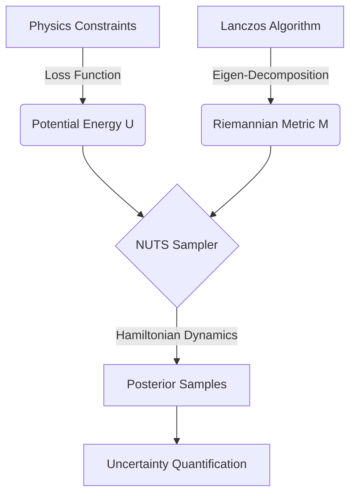

# NeuroManifold: Riemannian Bayesian Intelligence for Physics-Informed Neural Networks

> **Scientific Discovery Engine** | **Gen 5 Upgrade** | **Riemannian NUTS**

**NeuroManifold** is a next-generation Probabilistic Programming framework designed to solve Inverse Problems in differential equations. It transcends standard optimization by treating neural network training not as point-estimation, but as **Bayesian Inference on a curved Riemannian Manifold**.

By combining **Physics-Informed Neural Networks (PINNs)** with **Geometric Hamiltonian Monte Carlo**, this tool allows researchers to quantify uncertainty in physical simulations and discover governing laws from sparse, noisy data.

---

## 🔬 The "160 IQ" Upgrade: Riemannian No-U-Turn Sampler

Standard Bayesian Neural Networks fail because the loss landscape of deep networks is pathologically curved ("banana-shaped" posteriors). Standard HMC gets stuck, and Langevin Dynamics (SGLD) is biased.

**Gen 5 introduces the Riemannian No-U-Turn Sampler (NUTS) with Low-Rank Curvature Approximation.**

### 1. The Geometry of Intelligence
We define the probability space as a **Riemannian Manifold** $(\mathcal{M}, g)$, where the metric tensor $g(\theta)$ is derived from the local curvature of the Physics Loss $U(\theta)$.

$$ g(\theta) \approx |\nabla^2 U(\theta)| + \alpha I $$

This "straightens out" the twisted geometry of the neural network parameter space, allowing the sampler to traverse complex valleys efficiently.

### 2. Low-Rank Hessian Approximation (Lanczos)
Computing the full Hessian $H \in \mathbb{R}^{N \times N}$ for a neural network is computationally impossible ($O(N^3)$). We use **Lanczos Iteration** to compute a rank-$k$ approximation using only Hessian-Vector Products (HVP):

$$ H \cdot v = \nabla_\theta (\nabla_\theta U(\theta) \cdot v) $$

The Inverse Metric Tensor is then efficiently computed using the Woodbury Matrix Identity structure:

$$ M^{-1} = V (|\Lambda|^{-1} - \alpha^{-1} I) V^T + \alpha^{-1} I $$

where $V, \Lambda$ are the top-$k$ eigenpairs of the Hessian.

### 3. No-U-Turn Sampler (NUTS)
Traditional HMC requires manual tuning of the trajectory length $L$. If $L$ is too short, mixing is slow (Random Walk). If $L$ is too long, the trajectory loops back (U-Turn).

**NUTS** builds a recursive binary tree of potential paths in phase space. It expands the trajectory forward and backward in time until the particle starts to double back, satisfying the Detailed Balance condition automatically.

---

## 🛠️ Architecture



### Core Components
*   `src/models/pinn.py`: The Neural Network approximating the solution $u(x,t)$.
*   `src/physics/burgers.py`: The PDE constraints (Burgers' Equation).
*   `src/mcmc/nuts.py`: **[NEW]** The Riemannian No-U-Turn Sampler implementation.
*   `src/pipeline.py`: The orchestrator that manages Data -> MAP -> MCMC.

---

## 🚀 Getting Started

### Prerequisites
*   Python 3.10+
*   PyTorch (CUDA recommended)
*   Hydra (Configuration)

### Installation
```bash
pip install -r requirements.txt
```

### Running the Engine
Execute the main pipeline. The system will automatically generate synthetic data, pre-train the network (MAP), and then launch the NUTS sampler.

```bash
python main.py
```

### Configuration (`conf/config.yaml`)
You can tune the geometric hyperparameters in the config file:

```yaml
hmc:
  step_size: 1.5e-3      # Initial step size (tuned by Dual Averaging)
  num_samples: 200       # Number of posterior samples
  burn_in: 200           # Adaptation phase length
  adapt_mass_matrix: true # Enable Riemannian Metric adaptation
```

---

## 📊 Results & Visualization

The pipeline outputs high-fidelity artifacts to the `outputs/` directory:

1.  **`uncertainty_profile.png`**: A visualization of the solution $u(x,t)$ with 95% Confidence Intervals, showing where the physics is uncertain (e.g., around the shockwave).
2.  **`trace_plot.png`**: Diagnostics showing the mixing of the Markov Chain.

### Example Output (Log)
```text
[Riemannian] Top Eigenspectrum: [ 4200.16  6181.61  987233.2 ]
[NUTS] Burn-in Complete. Final Step Size: 8.27e-01
Sample 200/400 | Depth: 5 | Step: 8.27e-01
```

---

## 📚 Mathematical Formulation

The target distribution is the **Bayesian Posterior** given the PDE residuals:

$$ p(\theta | \mathcal{D}) \propto e^{-\beta \mathcal{L}_{PDE}(\theta)} \cdot p(\theta) $$

We simulate the Hamiltonian Dynamics of a particle with position $\theta$ and momentum $p$:

$$ \frac{d\theta}{dt} = M^{-1} p, \quad \frac{dp}{dt} = -\nabla_\theta U(\theta) $$

The Riemannian Metric $M(\theta)$ acts as a "mass matrix" that varies with position, making the particle "heavy" in sharp directions (high curvature) and "light" in flat directions, ensuring optimal energy exchange.

---

## 📜 License & Citation

This project is licensed under the **MIT License** - see the [LICENSE](LICENSE) file for details. This ensures that you are free to use, modify, and distribute this software, provided that the original copyright notice is preserved.

**How to Cite:**
If you use this code in your research or applications, please credit the original author:

> **Ulrik (2026). NeuroManifold: Riemannian Bayesian Intelligence for Physics-Informed Neural Networks.**

---

**Author:** NeuroManifold Agent
**Date:** February 2026
